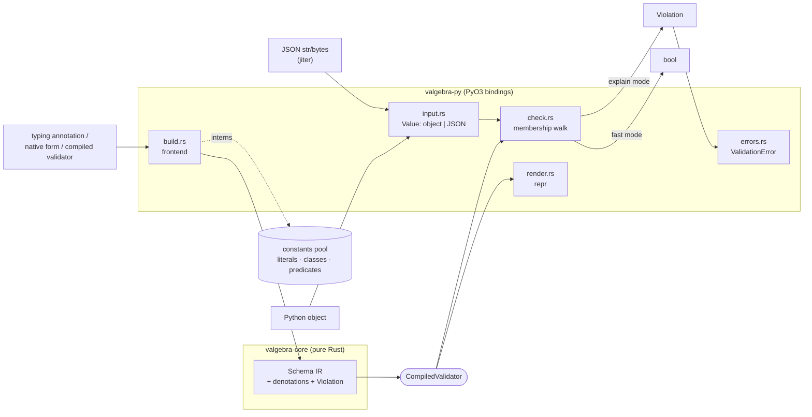

# Architecture

This is a bird's-eye map of valgebra for contributors: the components, how a
value flows through them, and the invariants that hold across the codebase. It
is deliberately not an API reference — the public API is documented in the
[docs site](https://ppigazzini.github.io/valgebra/), and the per-module detail
lives in the crate-level `//!` headers this page points at.

valgebra is a Rust-core Python library. A schema denotes a *set of Python
values*; validation is membership testing on the object the caller already holds
— zero-copy, zero-coercion. A schema compiles once into a validator tree, and
the hot path crosses into Rust exactly once per call.

## Components

| Component | Path | Owns | PyO3 |
| --- | --- | --- | --- |
| Core | [`crates/valgebra-core/`](crates/valgebra-core/src/lib.rs) | the schema IR, the denotation of every node, the structured `Violation` | no |
| Bindings | [`crates/valgebra-py/`](crates/valgebra-py/src/lib.rs) | the schema frontend, the membership walk, the error and `repr` layers; built as the `_valgebra` extension | yes |
| Package | [`python/valgebra/`](python/valgebra/__init__.py) | the importable public surface; `_valgebra` is private | — |

The core crate is pure Rust and pyo3-free, so it builds and tests on every OS
without a linked interpreter. Anything that must inspect a Python object — the
membership walk itself — lives in the bindings crate. Literals, class objects,
and user predicates the IR refers to by index live in a **constants pool** the
bindings own; the core stays language-agnostic.

## How a value flows

**Compile once.** The frontend ([`build.rs`](crates/valgebra-py/src/build.rs))
reads a typing annotation, a native form (a dict literal as a closed record, a
constant as a typed literal), or an already-compiled validator, and builds the
`Schema` IR, interning any literal, class, or predicate it references into the
constants pool. The result is wrapped in an immutable `CompiledValidator`.

**Validate fast.** Each call crosses into Rust once. The value — a Python object
or a JSON document — is presented through one `Value` abstraction
([`input.rs`](crates/valgebra-py/src/input.rs)), and a **single membership walk**
([`check.rs`](crates/valgebra-py/src/check.rs)) decides it. The walk runs in one
of two modes: a *fast* mode that returns a bool and allocates nothing, and an
*explain* mode that builds a `Violation` with the path, the expected label, and a
value summary. A `Violation` becomes the `ValidationError`
([`errors.rs`](crates/valgebra-py/src/errors.rs)) that `validate` raises.

The JSON path validates the parsed document in place against the same walk, so a
JSON document is judged exactly as `json.loads` of it would be — same decision,
same errors.

## The IR

The schema IR is one enum, [`Schema`](crates/valgebra-core/src/lib.rs), whose
variants are the node set:

- **Atoms** — `Anything` (lattice top), `Nothing` (bottom), `Any` (the gradual
  dynamic type, distinct from the top), `NoneType`, `Bool`, `Int`, `Float`,
  `Str`, `Bytes`, and `Literal` (a typed singleton, pooled).
- **Containers** — `Seq { container, regex }` carries every list and tuple form
  as a regular expression (`SeqRegex`: `Empty`, `Elem`, `Cat`, `Or`, `Star`)
  over element schemas; `Set` and `FrozenSet`; `KeyedMap { fields, defaults }`
  carries dicts, records, and maps as named fields plus key-schema-keyed default
  clauses.
- **Combinators** — `Union`, `Intersection`, `Complement`: the Boolean algebra.
- **Classes and refinement** — `Instance` (an `isinstance` check, pooled),
  `Object { fields }` (an instance whose attributes satisfy field schemas),
  `Refine { base, constraint }` (a base narrowed by a bound, length, or
  predicate constraint).
- **Recursion** — `SelfRef` / `Ref` tie the `recursive` fixpoint; the body must
  be guarded by a structural constructor so membership stays decidable.

`simplify` reduces a schema by the lattice laws — flatten, dedup, identities,
negation-normal form — and decides the complement laws and provable disjointness
for the concrete fragment, without ever changing which values the schema admits.
The theory this rests on is in [docs/foundations.md](docs/foundations.md).

## Public surface

The package re-exports everything from the top-level `valgebra` namespace:
`validator` and the `CompiledValidator` it returns (`validate`, `is_valid`,
`ensure`, `validate_json`, `is_valid_json`, the record transforms `open` and
`close`, and the set relations `is_subtype_of`, `is_equivalent`, `is_empty`);
the combinators `union`, `intersection`, `complement`, and `simplify`; the
structural builder `fixed_sequence`; the `recursive` fixpoint; the `Regex`
refinement marker; the lattice bounds `anything` and `nothing`; and
`ValidationError`. Conditional fields and key cardinality are composed from the
algebra (documented recipes), not shipped as combinators.

## Invariants

These hold across the codebase; a change that breaks one is a bug, not a
trade-off.

- **One walk.** Fast (`bool`) and explaining (`Violation`) validation are one
  code path parameterized by mode, not two hand-synced walks. This removes the
  divergence-bug class at the source.
- **One boundary crossing.** Tree walks, key lookups, and bound checks run in
  the Rust validator tree. Per-element Python work in the validation loop is not
  added. A user predicate is a documented Python-callback slow path, never a
  silent fallback on the default loop.
- **Check, don't parse.** `validate` and `is_valid` check membership of the
  actual object; they never copy or coerce. `ensure` is the explicit, separate
  value-returning mode.
- **Pyo3-free core.** The core crate links no interpreter; Python-aware logic
  lives in the bindings, and the constants pool keeps the IR language-agnostic.
- **Immutable validators.** A compiled validator never mutates after it is
  built, so one validator is shared across threads, including on free-threaded
  CPython.

## Where to look next

- Building or changing a node: start at the `Schema` enum and its `//!` header
  in [`crates/valgebra-core/src/lib.rs`](crates/valgebra-core/src/lib.rs), then
  the frontend and the walk.
- The theory behind the algebra: [docs/foundations.md](docs/foundations.md).
- The development gate, the testing strategy, and the CI pipeline:
  [CONTRIBUTING.md](CONTRIBUTING.md).
- The invariants that bind agent and human contributors alike:
  [AGENTS.md](AGENTS.md).
