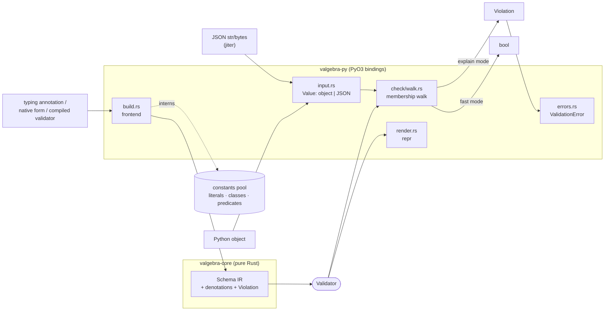

# Architecture

This is a bird's-eye map of valgebra for contributors: the components, how a
value flows through them, and the invariants that hold across the codebase. It
is deliberately not an API reference — the public API is documented in the
[docs site](https://ppigazzini.github.io/valgebra/), and the per-module detail
lives in the crate-level `//!` headers this page points at.

valgebra is a Rust-core Python library. A schema denotes a *set of Python
values*; validation is membership testing on the object the caller already holds
— zero-copy, zero-coercion. A schema compiles once into a validator tree, and
the hot path crosses into Rust exactly once per call.

## Components

| Component | Path | Owns | PyO3 |
| --- | --- | --- | --- |
| Core | [`crates/valgebra-core/`](crates/valgebra-core/src/ir.rs) | the schema IR and the denotation of every node, the two schema-to-schema deciders (`decision.rs` and `descr/`), and the structured `Violation` | no |
| Bindings | [`crates/valgebra-py/`](crates/valgebra-py/src/lib.rs) | the schema frontend, the membership walk, the error and `repr` layers; built as the `_valgebra` extension | yes |
| Package | [`python/valgebra/`](python/valgebra/__init__.py) | the importable public surface; `_valgebra` is private | — |

The core crate is pure Rust and pyo3-free, so it builds and tests on every OS
without a linked interpreter. Anything that must inspect a Python object — the
membership walk itself — lives in the bindings crate. Literals, class objects,
and user predicates the IR refers to by index live in a **constants pool** the
bindings own; the core stays language-agnostic.

## How a value flows

```mermaid
flowchart LR
    subgraph py["valgebra-py (PyO3 bindings)"]
        direction TB
        FE["build.rs<br/>frontend"]
        CHK["check/walk.rs<br/>membership walk"]
        INP["input.rs<br/>Value: object | JSON"]
        ERRM["errors.rs<br/>ValidationError"]
        REN["render.rs<br/>repr"]
    end
    subgraph core["valgebra-core (pure Rust)"]
        IR["Schema IR<br/>+ denotations + Violation"]
    end

    SPEC["typing annotation /<br/>native form / compiled validator"] --> FE
    FE --> IR
    FE -. interns .-> POOL[("constants pool<br/>literals · classes · predicates")]
    IR --> CV(["Validator"])

    OBJ["Python object"] --> INP
    JS["JSON str/bytes<br/>(jiter)"] --> INP
    CV --> CHK
    INP --> CHK
    CHK -->|fast mode| BOOL["bool"]
    CHK -->|explain mode| VIO["Violation"]
    VIO --> ERRM
    CV --> REN
```

**Compile once.** The frontend ([`build.rs`](crates/valgebra-py/src/build.rs))
reads a typing annotation, a native form (a dict literal as a closed record, a
constant as a typed literal), or an already-compiled validator, and builds the
`Schema` IR, interning any literal, class, or predicate it references into the
constants pool. The result is wrapped in an immutable `Validator`.

**Validate fast.** Each call crosses into Rust once. The value — a Python object
or a JSON document — is presented through one `Value` abstraction
([`input.rs`](crates/valgebra-py/src/input.rs)), and a **single membership walk**
([`check/walk.rs`](crates/valgebra-py/src/check/walk.rs)) decides it. The walk runs in one
of two modes: a *fast* mode that returns a bool and allocates nothing, and an
*explain* mode that builds a `Violation` with the path, the expected label, and a
value summary. A `Violation` becomes the `ValidationError`
([`errors.rs`](crates/valgebra-py/src/errors.rs)) that `validate` raises.

The JSON path validates the parsed document in place against the same walk, so a
JSON document is judged exactly as `json.loads` of it would be — same decision,
same errors.

## How two schemas are compared

`is_subtype_of`, `relation_to`, `is_equivalent` and `is_empty` take no value at
all, so they run entirely in the core. Two representations answer them and both
answer in three values — proved, refuted, or neither:

- **the rules** ([`decision.rs`](crates/valgebra-core/src/decision.rs) and the
  modules beside it) recurse over the two schema trees and apply inclusion rules
  to their shapes;
- **the descriptor** ([`descr/`](crates/valgebra-core/src/descr/mod.rs)) is the
  definition rather than an optimisation of it: the value universe is
  partitioned by `Kind`, each kind carries a representation closed under union,
  intersection and complement, and `a <= b` is asked as `a ∧ ¬b` admitting no
  value.

The rules are asked first and the descriptor only where they *decline*, because
building one costs about two orders of magnitude more than a rule that already
answered. Neither can overturn the other: both are sound, so the pair gives
whichever of them decides. The core cannot see a Python object, so a question
about a class, a constant or a comparison operand is asked back through the
`LeafRelations` trait, which
[`crates/valgebra-py/src/oracle.rs`](crates/valgebra-py/src/oracle.rs)
implements. [docs/dev/02-decision.md](docs/dev/02-decision.md) owns the detail
and [docs/15-decidability.md](docs/15-decidability.md) the published boundary.

## The IR

The schema IR is one enum, [`Schema`](crates/valgebra-core/src/ir.rs), whose
variants are the node set:

- **Atoms** — `Anything(Spelling)` (lattice top), `Nothing` (bottom), `NoneType`,
  `Bool`, `Int`, `Float`, `Str`, `Bytes`, and `Literal` (a typed singleton,
  pooled). There is no separate gradual node: `typing.Any` builds `Anything`
  carrying the spelling `repr` reads, so every law and every relation sees the
  top.
- **Containers** — `Seq { container, shape }` carries every list and tuple form
  as a `SeqShape`: a positional `prefix` of element schemas and an optional
  repeated `tail`. `Coll { container, element }` carries sets and frozensets,
  the container being the `CollKind` rather than a variant each.
  `KeyedMap { fields, defaults }` carries dicts, records, and maps as named
  fields plus key-schema-keyed default clauses, which are a disjunction and not
  a precedence list.
- **Combinators** — `Union`, `Intersection`, `Complement`: the Boolean algebra.
- **Classes and refinement** — `Instance` (an `isinstance` check, pooled),
  `AttrRecord { fields }` (a value whose attributes satisfy field schemas, with
  **no class** of its own, so a dataclass is the meet `Instance(C) ∧
  AttrRecord` and the algebra can relate either half alone),
  `Refine { base, constraints }` (a base narrowed by bound, length, pattern, or
  predicate constraints).
- **Recursion** — `SelfRef` / `Ref` tie the `recursive` fixpoint; the body must
  be guarded by a structural constructor so membership stays decidable.

Every variant's doc comment states its **denotation** — the set of Python values
it admits — and that comment is where a claim about meaning is checked. A schema
is built in the lattice normal form, so the folds are the constructors' rather
than a later pass's; `crates/valgebra-core/src/simplify.rs` is that pass, and it
is deprecated. The theory is in [docs/13-foundations.md](docs/13-foundations.md)
and, for a contributor, [docs/dev/01-schema-ir.md](docs/dev/01-schema-ir.md).

## Public surface

The package re-exports everything from the top-level `valgebra` namespace:
the `Validator` class -- `Validator(schema)` compiles a schema -- and its
methods (`validate`, `is_valid`, `ensure`, `validate_json`, `load`,
`is_valid_json`, the record-openness transforms `open` and `close`, and the set
relations `is_subtype_of`, `relation_to`, `is_equivalent`, `is_empty`); the
combinators `union`, `intersection`, and `complement`; the `recursive` fixpoint;
the `Regex` refinement marker; the lattice bounds `anything` and `nothing`; the
three construction limits `MAX_SCHEMA_DEPTH`, `MAX_DEFINITIONS` and
`MAX_SCHEMA_NODES`; and `ValidationError`. `Validator.simplify` is exported too
and is **deprecated**, removed in the next minor version. A fixed-length list is
the native `[A, B]` literal. Conditional fields and key cardinality are composed
from the algebra (documented recipes), not shipped as combinators.

The operator surface is `obj in validator` (membership), `a | b` (union, the
spelling typing itself uses), `==` (the normal form, kept distinct from the
semantic `is_equivalent`) and `hash`. There is no `&` and no `~`: typing has no
operator for intersection or complement, so valgebra invents none.

## Invariants

These hold across the codebase; a change that breaks one is a bug, not a
trade-off.

- **One walk.** Fast (`bool`) and explaining (`Violation`) validation are one
  code path parameterized by mode, not two hand-synced walks. This removes the
  divergence-bug class at the source.
- **One boundary crossing.** Tree walks, key lookups, and bound checks run in
  the Rust validator tree. Per-element Python work in the validation loop is not
  added. A user predicate is a documented Python-callback slow path, never a
  silent fallback on the default loop.
- **Check, don't parse.** `validate` and `is_valid` check membership of the
  actual object; they never copy or coerce. `ensure` is the explicit, separate
  value-returning mode.
- **Pyo3-free core.** The core crate links no interpreter; Python-aware logic
  lives in the bindings, and the constants pool keeps the IR language-agnostic.
- **Immutable validators.** A compiled validator never mutates after it is
  built, so one validator is shared across threads. Free-threaded (no-GIL)
  CPython 3.14 is supported: the extension declares `gil_used = false`, imports
  without re-enabling the GIL, and the concurrency suite exercises true parallel
  validation there.

## Distribution

The extension ships as a **per-interpreter-version** module, not a stable-ABI
(`abi3`) wheel. This is a deliberate trade:

- **Why per-version.** A per-version build is free to use profile-guided
  optimization (PGO) and version-specific fast paths. PGO records its profile by
  *running* the instrumented build, so it needs a concrete interpreter; an
  `abi3` wheel would forfeit that and pin the build to the `abi3` floor. The
  recorded hot-path speedup is on the [performance page](docs/11-performance.md).
- **The cost it imposes.** One wheel per supported CPython minor. The release
  matrix must therefore cover every minor in `requires-python` (`>=3.10`, so
  3.10 through 3.14, matching the `classifiers` in `pyproject.toml`); an
  uncovered minor would get no wheel.
- **How the matrix covers it.** The release workflow builds with maturin
  `--find-interpreter`, which builds for every CPython the build image exposes
  that satisfies `requires-python`, across manylinux and musllinux, macOS (Intel
  and Apple silicon), and Windows. PGO applies on the hosts that run their own
  output; the musllinux cross-builds and the Windows arm64 target ship plain
  release builds with the same compatibility. A dispatch with no publish target
  builds the whole matrix as a dry run, which is how matrix coverage is verified
  before a release.
- **Free-threaded wheels ship where available.** Where the image exposes a
  free-threaded interpreter, `--find-interpreter` also builds a free-threaded
  `cp314t` wheel. That wheel is part of the published set.

The interpreter is never embedded in the shipped wheel: maturin builds the
extension module, and the `pyo3` `extension-module` feature is injected at
wheel-build time rather than set in `Cargo.toml`, so non-maturin builds (such as
`cargo test`) link an interpreter normally.

## Where to look next

- Building or changing a node: start at the `Schema` enum and its `//!` header
  in [`crates/valgebra-core/src/lib.rs`](crates/valgebra-core/src/lib.rs), then
  the frontend and the walk.
- The theory behind the algebra: [docs/13-foundations.md](docs/13-foundations.md).
- The development gate, the testing strategy, and the CI pipeline:
  [CONTRIBUTING.md](CONTRIBUTING.md).
- The invariants that bind agent and human contributors alike:
  [AGENTS.md](AGENTS.md).
